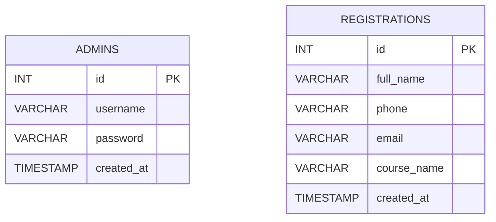

# Thiết Kế Cơ Sở Dữ Liệu

## 1. Tổng quan

Dự án sử dụng MySQL với database chính:

- `landing_page_db`

Hệ thống hiện tại có 2 bảng chính:

- `admins`
- `registrations`

## 2. Mục đích của từng bảng

### 2.1 Bảng `admins`

Dùng để lưu thông tin tài khoản quản trị.

Chức năng:

- đăng nhập admin
- kiểm tra thông tin tài khoản

### 2.2 Bảng `registrations`

Dùng để lưu thông tin học viên đăng ký từ landing page.

Chức năng:

- nhận dữ liệu từ form frontend
- hiển thị danh sách trong dashboard admin

## 3. Chi tiết bảng `admins`

| Tên cột | Kiểu dữ liệu | Ý nghĩa |
|---|---|---|
| `id` | `INT, PK, AI` | Khóa chính của admin |
| `username` | `VARCHAR(100)` | Tên đăng nhập admin |
| `password` | `VARCHAR(255)` | Mật khẩu đã hash bcrypt |
| `created_at` | `TIMESTAMP` | Thời điểm tạo tài khoản |

### Ghi chú

- `username` là duy nhất
- `password` không lưu plain text
- hệ thống dùng `password_verify()` để kiểm tra mật khẩu

## 4. Chi tiết bảng `registrations`

| Tên cột | Kiểu dữ liệu | Ý nghĩa |
|---|---|---|
| `id` | `INT, PK, AI` | Khóa chính của bản ghi đăng ký |
| `full_name` | `VARCHAR(150)` | Họ tên học viên |
| `phone` | `VARCHAR(20)` | Số điện thoại |
| `email` | `VARCHAR(150)` | Email học viên |
| `course_name` | `VARCHAR(150)` | Khóa học quan tâm |
| `created_at` | `TIMESTAMP` | Thời điểm đăng ký |

## 5. Quan hệ giữa các bảng

Ở phiên bản hiện tại:

- `admins` và `registrations` chưa có quan hệ khóa ngoại trực tiếp
- `admins` dùng cho xác thực quản trị
- `registrations` dùng cho dữ liệu nghiệp vụ tuyển sinh

Nói cách khác:

- `admins` quản lý quyền truy cập dashboard
- `registrations` chứa dữ liệu mà dashboard hiển thị

## 6. Sơ đồ database đơn giản

## 7. Dữ liệu mẫu ban đầu

Hệ thống có tài khoản admin mặc định:

- `username`: `admin`
- `password`: `saduqkl)2.`

Mật khẩu này được lưu trong database dưới dạng bcrypt hash.

## 8. Cách ứng dụng làm việc với database

### Với bảng `admins`

File liên quan:

- `app/Models/AdminModel.php`

Query chính:

- tìm admin theo `username`

### Với bảng `registrations`

File liên quan:

- `app/Models/RegistrationModel.php`

Query chính:

- thêm bản ghi đăng ký mới
- lấy toàn bộ danh sách đăng ký theo thứ tự mới nhất

## 9. Điểm an toàn đã áp dụng

- Dùng PDO
- Dùng prepared statement cho query có dữ liệu đầu vào từ form
- Không nối chuỗi SQL trực tiếp với dữ liệu người dùng

## 10. Hướng mở rộng database sau này

- Thêm bảng `courses`
- Thêm bảng `admin_logs`
- Thêm bảng `settings`
- Thêm trạng thái xử lý cho `registrations`
- Thêm cột `note`, `status`, `updated_at`
