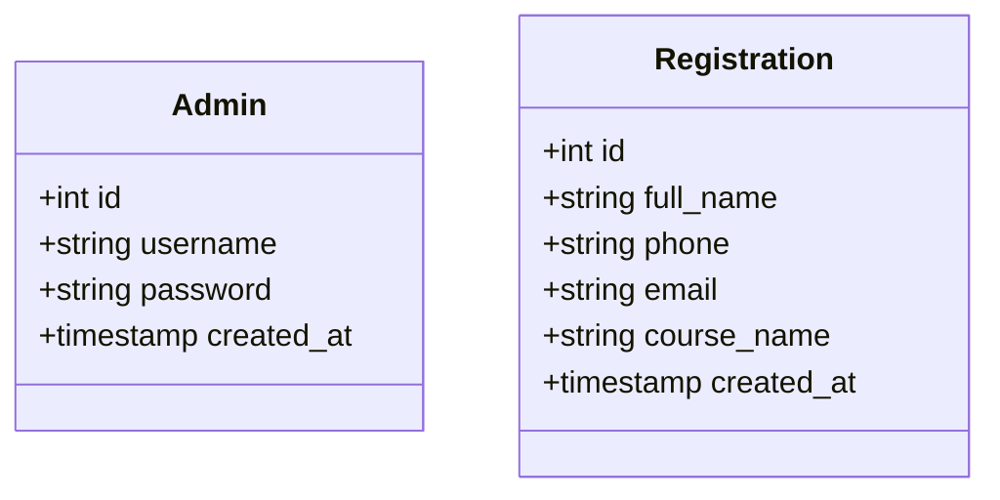
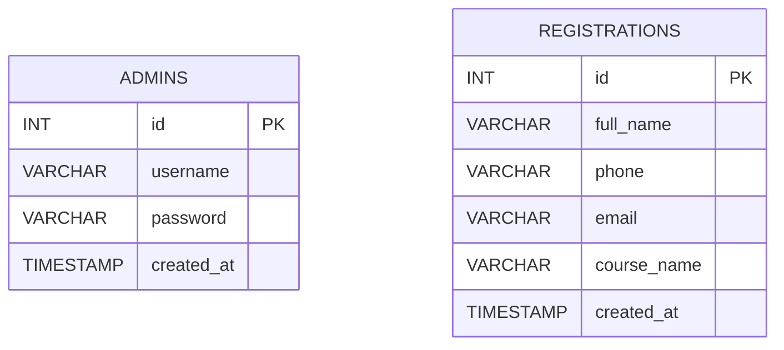

# Biểu Đồ Lớp Cơ Sở Dữ Liệu Quan Hệ

Tài liệu này mô tả mô hình dữ liệu của dự án theo góc nhìn lớp dữ liệu và bảng quan hệ.

## 1. Biểu đồ lớp dữ liệu

## 2. Biểu đồ quan hệ cơ sở dữ liệu

## 3. Giải thích

### Bảng `admins`

Mục đích:

- lưu tài khoản quản trị
- phục vụ xác thực đăng nhập admin

### Bảng `registrations`

Mục đích:

- lưu dữ liệu học viên đăng ký từ landing page
- làm nguồn dữ liệu cho dashboard admin

## 4. Đặc điểm của mô hình dữ liệu

- Mô hình hiện tại đơn giản và phù hợp với bài tập hoặc đồ án mức cơ bản
- Chưa có khóa ngoại giữa `admins` và `registrations`
- Chưa có bảng danh mục khóa học riêng
- Phù hợp với use case:
  - thu thập thông tin
  - xem danh sách đăng ký

## 5. Hướng mở rộng

Có thể mở rộng thêm các bảng:

- `courses`
- `registration_statuses`
- `admin_logs`
- `settings`

Ví dụ nếu thêm bảng `courses`, cột `course_name` trong `registrations` có thể đổi thành `course_id` để dữ liệu chuẩn hóa hơn.
