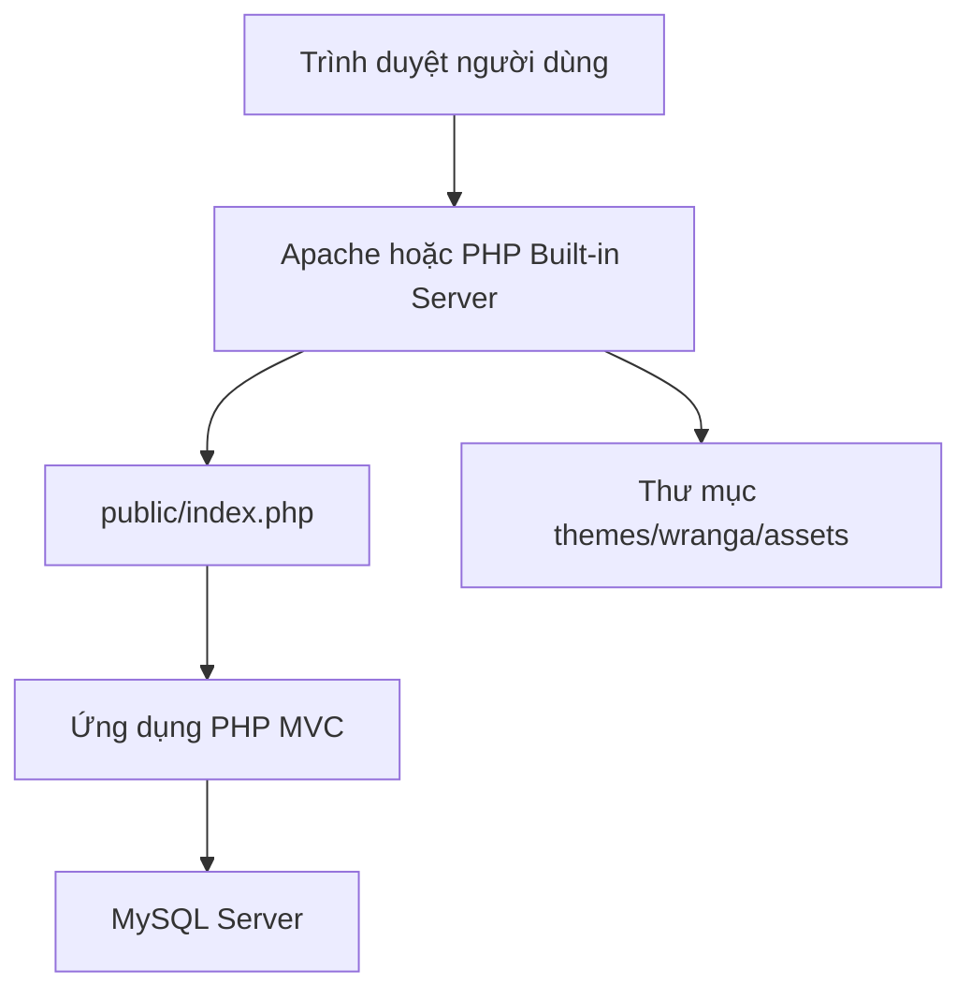
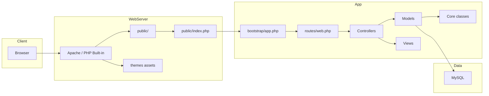
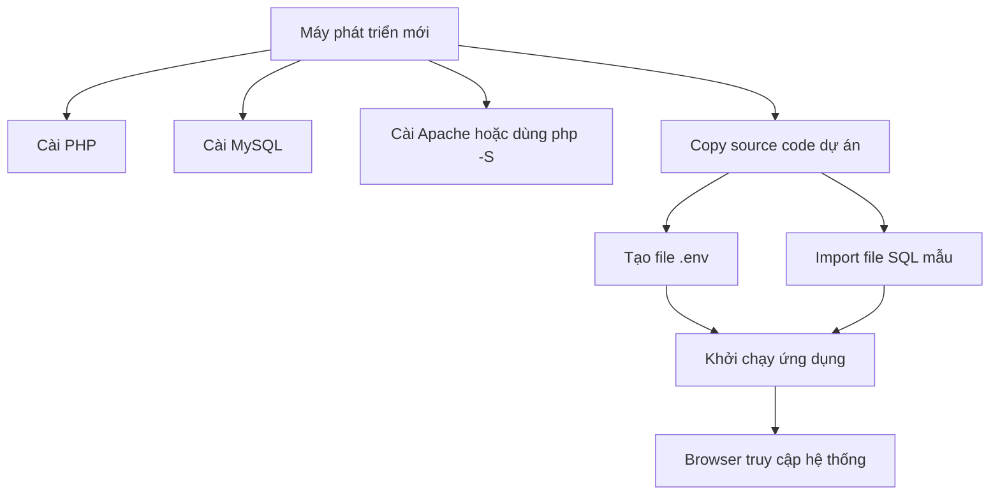

# Biểu Đồ Triển Khai

Tài liệu này mô tả cách hệ thống được triển khai trên môi trường local hoặc môi trường chạy thật đơn giản.

## 1. Mô hình triển khai local

## 2. Mô hình triển khai chi tiết

## 3. Giải thích các node triển khai

### Trình duyệt

Là nơi người dùng hoặc admin truy cập hệ thống.

### Web server

Có thể là:

- Apache
- PHP built-in server khi chạy local

Vai trò:

- nhận request từ browser
- trả asset tĩnh
- chuyển request động vào `public/index.php`

### Ứng dụng PHP MVC

Bao gồm:

- bootstrap
- routes
- core
- controllers
- models
- views

### MySQL

Là nơi lưu:

- tài khoản admin
- dữ liệu đăng ký học viên

## 4. Biểu đồ triển khai theo môi trường mới

## 5. Kết luận

Biểu đồ triển khai cho thấy hệ thống có kiến trúc triển khai đơn giản:

- 1 web server
- 1 ứng dụng PHP
- 1 database MySQL

Đây là mô hình phù hợp với:

- đồ án môn học
- project demo
- hệ thống landing page quy mô nhỏ

Nếu phát triển thêm trong tương lai, có thể mở rộng theo hướng:

- tách web server và app server
- thêm reverse proxy
- thêm logging service
- thêm backup database
