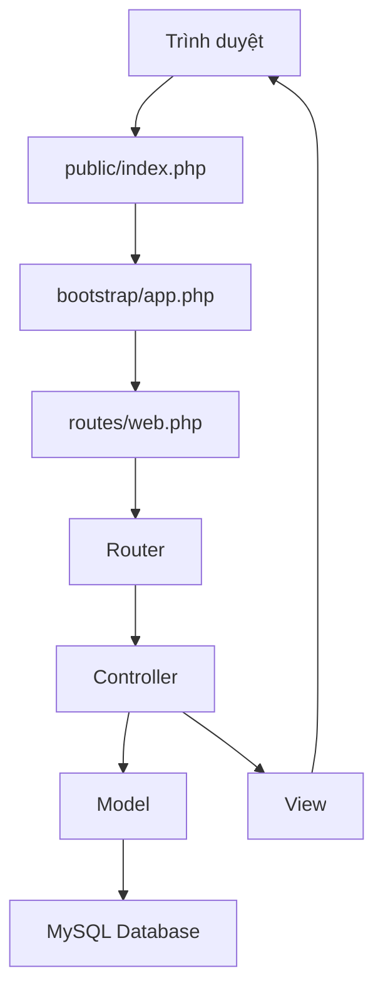
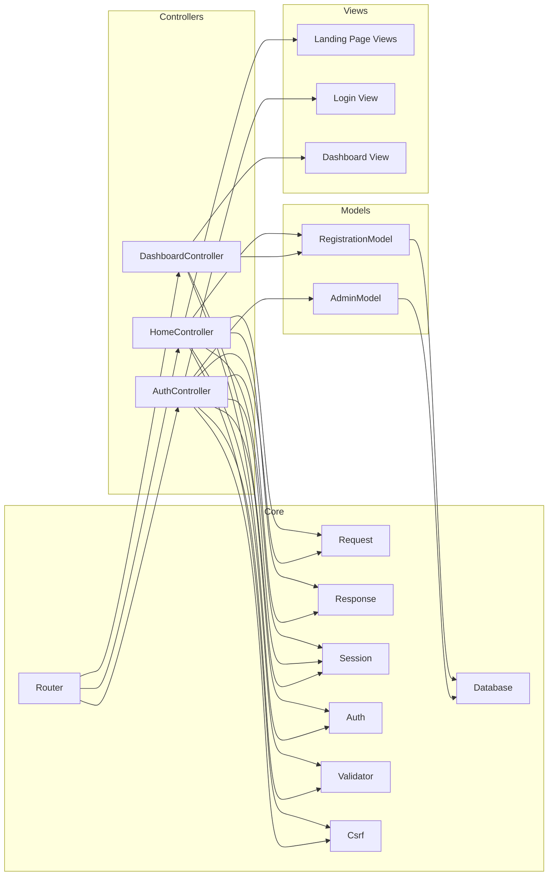
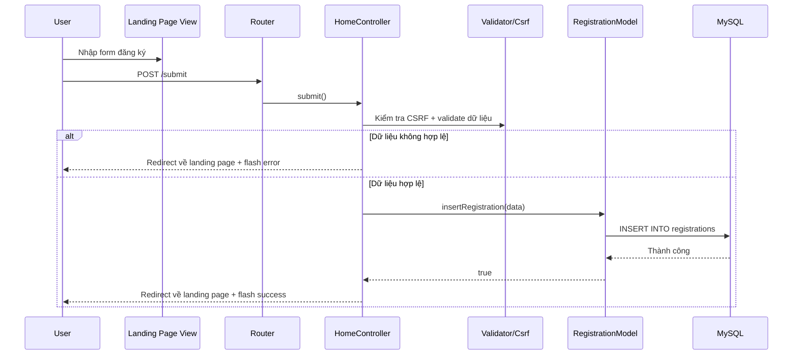
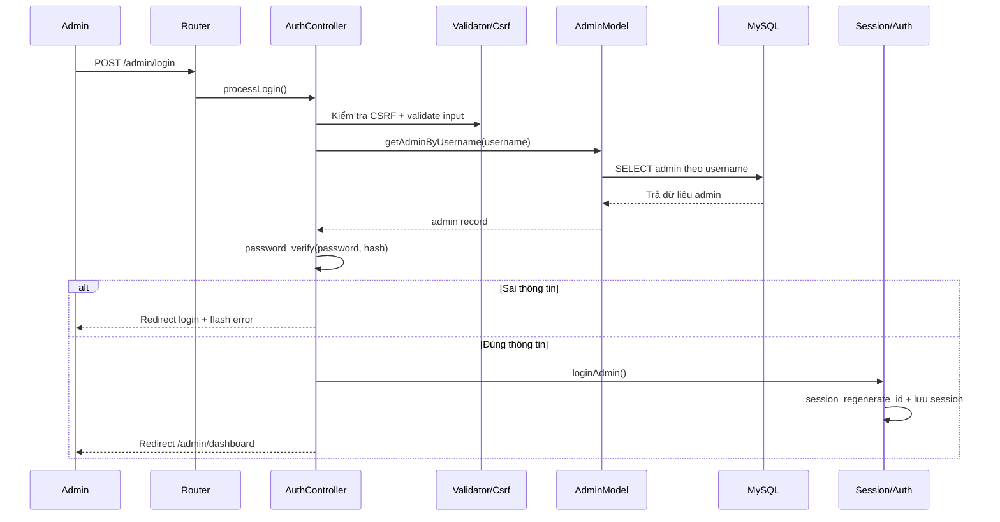
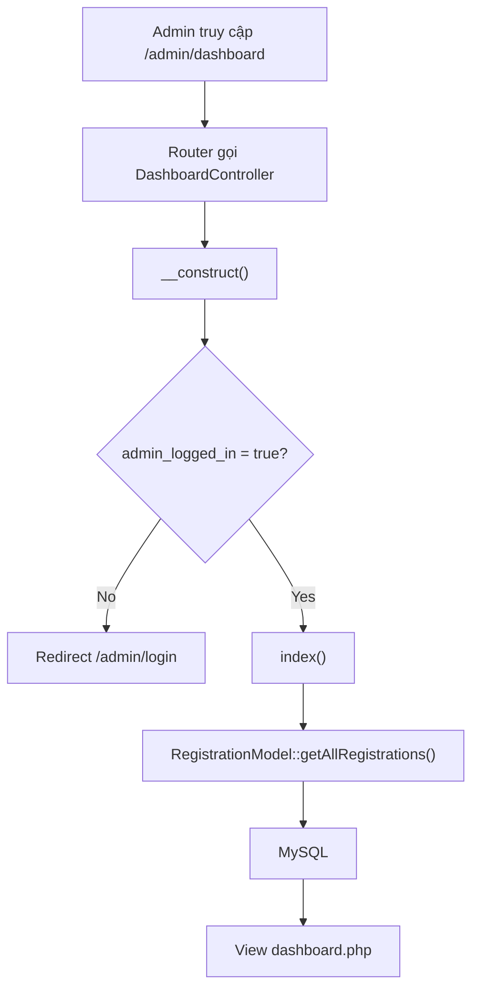
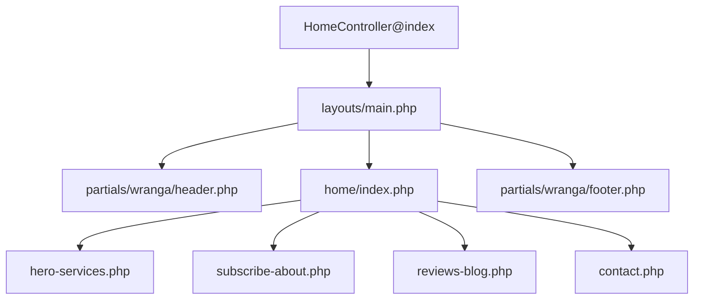

# Sơ Đồ Hệ Thống

Tài liệu này mô tả hệ thống bằng sơ đồ Mermaid để dễ đưa vào báo cáo hoặc thuyết trình.

## 1. Sơ đồ kiến trúc tổng thể

## 2. Sơ đồ thành phần MVC

## 3. Sơ đồ luồng đăng ký học viên

## 4. Sơ đồ luồng đăng nhập admin

## 5. Sơ đồ bảo vệ dashboard admin

## 6. Sơ đồ tích hợp theme frontend

