# Use Case Chi Tiết Cho Các Chức Năng Chính

Tài liệu này đặc tả chi tiết các use case chính của hệ thống.

## 1. UC02 - Gửi form đăng ký

### 1.1 Đặc tả use case

| Thuộc tính | Mô tả |
|---|---|
| Mã use case | UC02 |
| Tên use case | Gửi form đăng ký |
| Actor chính | Khách truy cập |
| Mục tiêu | Gửi thông tin đăng ký khóa học từ landing page |
| Tiền điều kiện | Người dùng đang truy cập landing page |
| Hậu điều kiện | Dữ liệu được lưu vào bảng `registrations` nếu hợp lệ |

### 1.2 Luồng chính

1. Người dùng nhập họ tên, số điện thoại, email, khóa học.
2. Người dùng nhấn nút gửi form.
3. Hệ thống kiểm tra CSRF token.
4. Hệ thống kiểm tra dữ liệu đầu vào.
5. Hệ thống lưu dữ liệu vào database.
6. Hệ thống thông báo đăng ký thành công.

### 1.3 Luồng thay thế

- Nếu CSRF token không hợp lệ:
  - hệ thống từ chối request
  - quay lại landing page với thông báo lỗi

- Nếu dữ liệu không hợp lệ:
  - hệ thống không lưu database
  - hiển thị lỗi đầu tiên cho người dùng

- Nếu database lỗi:
  - hệ thống trả về thông báo lưu dữ liệu thất bại

### 1.4 Biểu đồ hoạt động

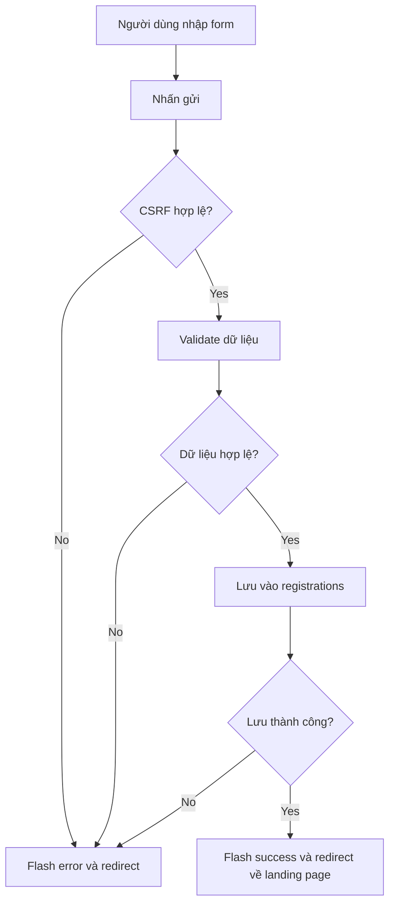

### 1.5 Biểu đồ trình tự

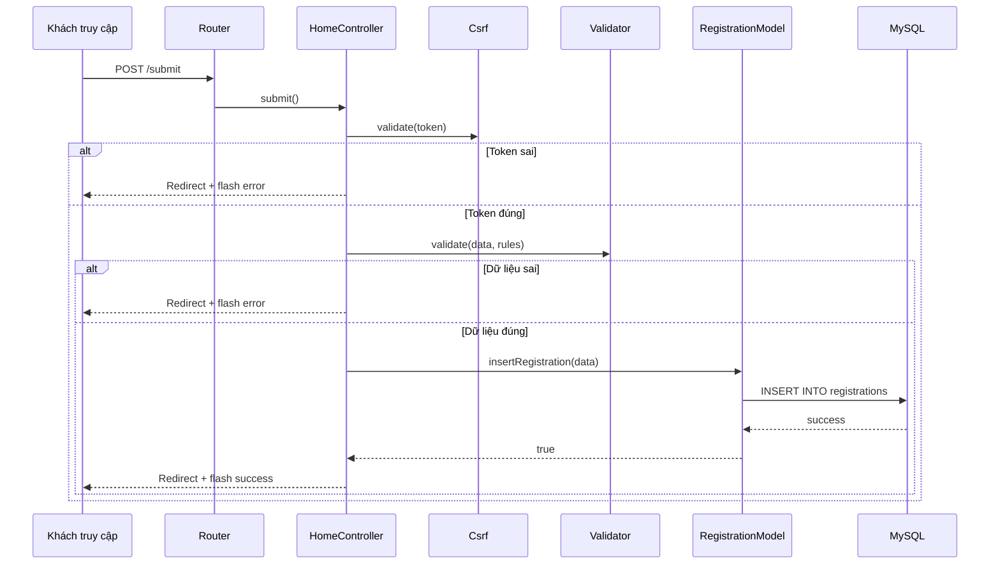

### 1.6 Biểu đồ lớp

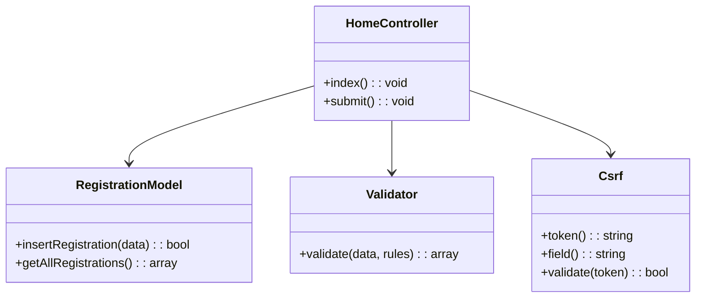

## 2. UC03 - Đăng nhập admin

### 2.1 Đặc tả use case

| Thuộc tính | Mô tả |
|---|---|
| Mã use case | UC03 |
| Tên use case | Đăng nhập admin |
| Actor chính | Admin |
| Mục tiêu | Truy cập khu vực quản trị |
| Tiền điều kiện | Admin có tài khoản hợp lệ |
| Hậu điều kiện | Session admin được tạo |

### 2.2 Luồng chính

1. Admin truy cập trang login.
2. Admin nhập username và password.
3. Hệ thống kiểm tra CSRF token.
4. Hệ thống validate dữ liệu.
5. Hệ thống tìm admin theo username.
6. Hệ thống kiểm tra password bằng `password_verify()`.
7. Hệ thống tạo session admin.
8. Chuyển hướng vào dashboard.

### 2.3 Luồng thay thế

- Nếu token không hợp lệ:
  - quay lại trang login

- Nếu dữ liệu không hợp lệ:
  - hiển thị lỗi

- Nếu username hoặc password sai:
  - hiển thị lỗi đăng nhập

### 2.4 Biểu đồ hoạt động

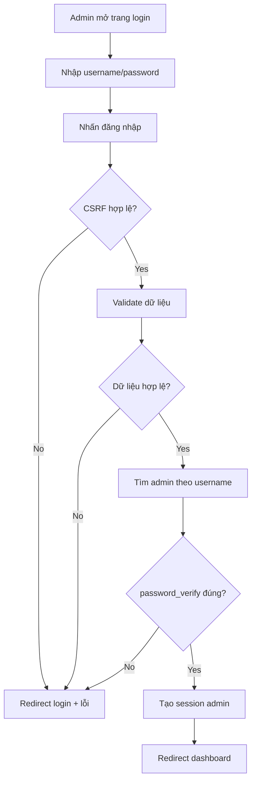

### 2.5 Biểu đồ trình tự

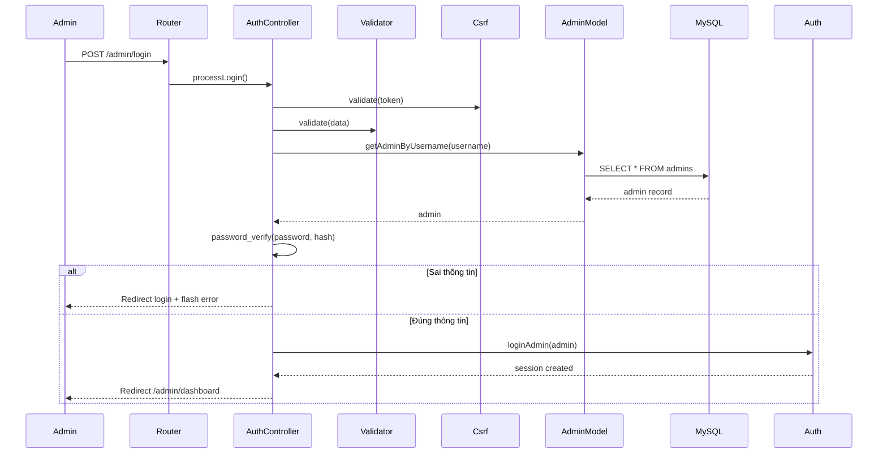

### 2.6 Biểu đồ lớp

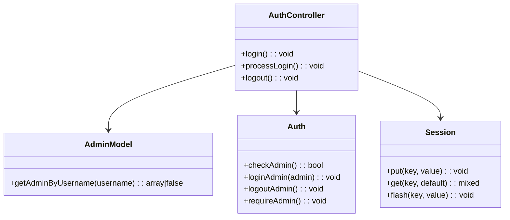

## 3. UC04 - Xem dashboard đăng ký

### 3.1 Đặc tả use case

| Thuộc tính | Mô tả |
|---|---|
| Mã use case | UC04 |
| Tên use case | Xem dashboard đăng ký |
| Actor chính | Admin |
| Mục tiêu | Xem danh sách học viên đã đăng ký |
| Tiền điều kiện | Admin đã đăng nhập |
| Hậu điều kiện | Danh sách đăng ký được hiển thị trên dashboard |

### 3.2 Luồng chính

1. Admin truy cập `/admin/dashboard`
2. Hệ thống kiểm tra session đăng nhập
3. Nếu hợp lệ, hệ thống lấy danh sách đăng ký từ database
4. Hệ thống hiển thị dữ liệu dạng bảng

### 3.3 Luồng thay thế

- Nếu chưa đăng nhập:
  - redirect về `/admin/login`

### 3.4 Biểu đồ hoạt động

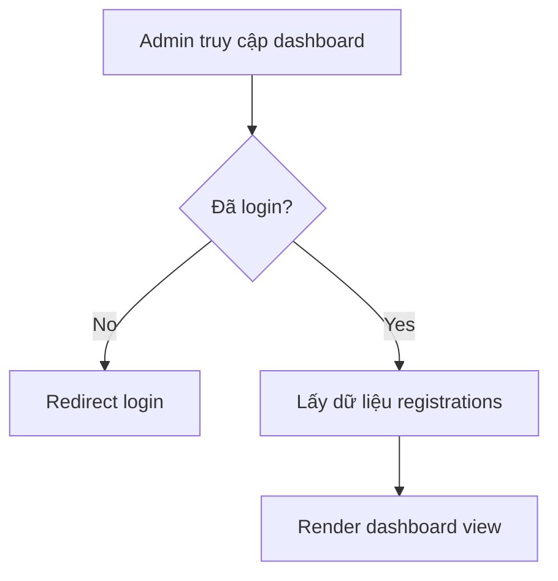

### 3.5 Biểu đồ trình tự

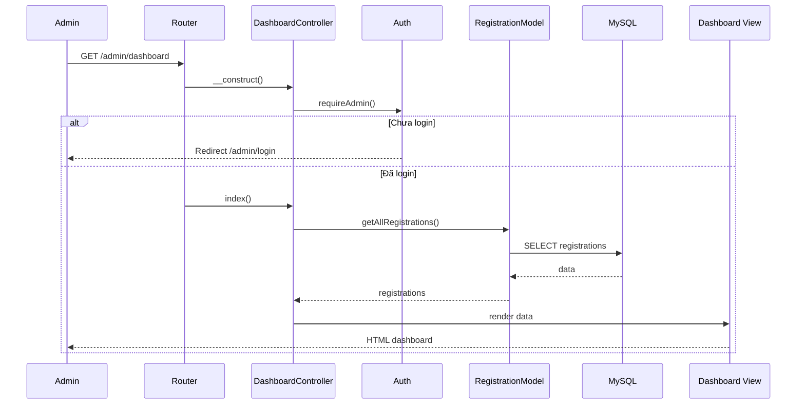

### 3.6 Biểu đồ lớp

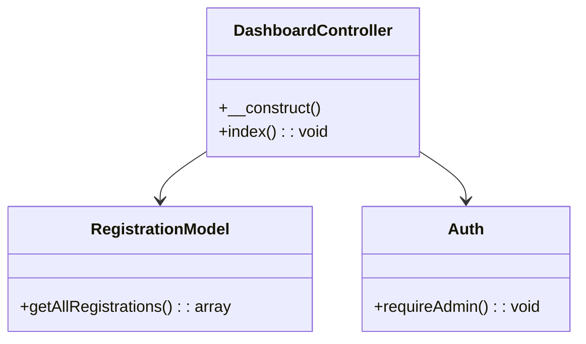

## 4. UC05 - Đăng xuất admin

### 4.1 Đặc tả use case

| Thuộc tính | Mô tả |
|---|---|
| Mã use case | UC05 |
| Tên use case | Đăng xuất admin |
| Actor chính | Admin |
| Mục tiêu | Kết thúc phiên làm việc quản trị |
| Tiền điều kiện | Admin đã đăng nhập |
| Hậu điều kiện | Session bị xóa và quay về trang login |

### 4.2 Biểu đồ hoạt động

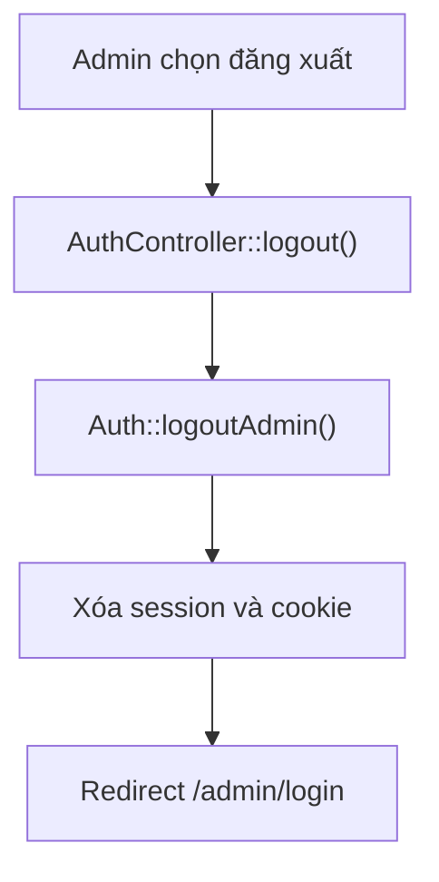

### 4.3 Biểu đồ trình tự

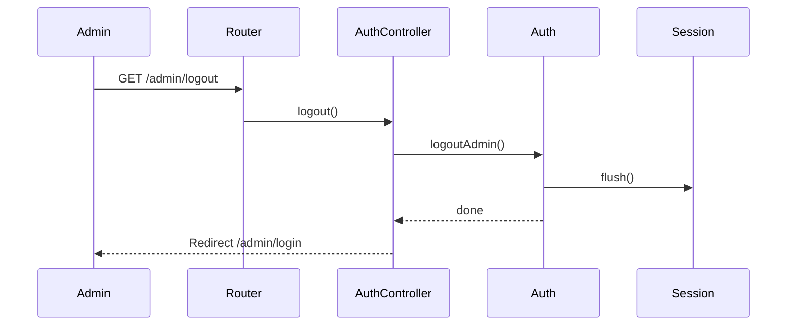
