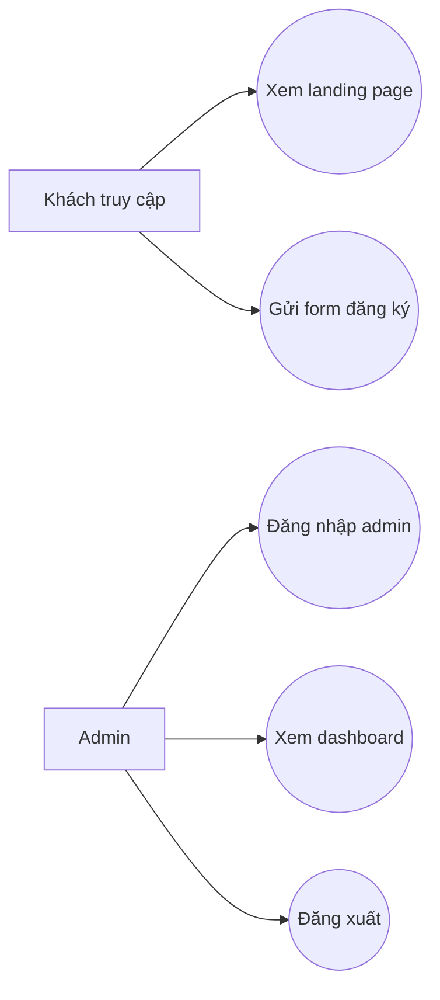

# Biểu Đồ Use Case Tổng Quát

Tài liệu này mô tả các actor và chức năng chính của hệ thống Landing Page tuyển sinh.

## 1. Actor của hệ thống

### 1.1 Khách truy cập

Là người dùng bên ngoài truy cập landing page.

Quyền và chức năng:

- xem landing page
- gửi form đăng ký tư vấn / đăng ký học

### 1.2 Admin

Là người quản trị hệ thống.

Quyền và chức năng:

- đăng nhập hệ thống
- xem dashboard danh sách đăng ký
- đăng xuất

## 2. Biểu đồ use case tổng quát

## 3. Danh sách use case chính

| Mã use case | Tên use case | Actor |
|---|---|---|
| UC01 | Xem landing page | Khách truy cập |
| UC02 | Gửi form đăng ký | Khách truy cập |
| UC03 | Đăng nhập admin | Admin |
| UC04 | Xem dashboard đăng ký | Admin |
| UC05 | Đăng xuất admin | Admin |

## 4. Mối liên hệ giữa các use case

- `Xem landing page` là điều kiện nền để người dùng thực hiện `Gửi form đăng ký`
- `Đăng nhập admin` là điều kiện bắt buộc trước khi thực hiện `Xem dashboard`
- `Đăng xuất admin` chỉ thực hiện sau khi admin đã đăng nhập

## 5. Ý nghĩa của use case tổng quát

Biểu đồ use case tổng quát cho thấy hệ thống hiện tại tập trung vào 2 nhóm chức năng:

- Nhóm frontend tuyển sinh
- Nhóm quản trị admin

Đây là mô hình phù hợp với một landing page giới thiệu khóa học có nhu cầu thu thập thông tin khách hàng tiềm năng và quản lý dữ liệu đăng ký ở mức cơ bản.
